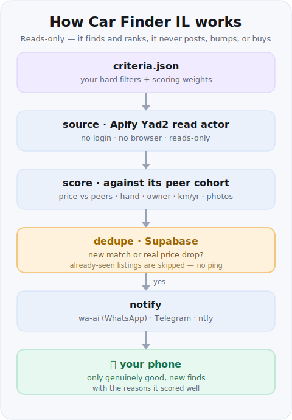

# car-finder-il 🚗

Find a good second-hand car in Israel — and get pinged on your phone **only when
something genuinely worth it appears.**

Yad2's own saved-search alerts are free, but they fire on *every* crude match.
This finds the same listings, then **scores each car against its own peer cohort**
(price vs comparable listings, hand/יד, owner type, km-per-year, photos) and pings
you only when a car actually beats the pack. Reads-only — it finds and ranks, it
never posts, bumps, or buys.

> 🇮🇱 גרסה בעברית: [README.he.md](README.he.md) · מדריך: [docs/HOWTO.he.md](docs/HOWTO.he.md)

## 60-second try (no tokens, no network)

```bash
python3 scripts/carfinder.py search examples/criteria.example.json --source mock --lang en
```

You'll get a ranked shortlist with a reason line per car. That's the whole value
in one command:

```text
Top 5 of 5 matches (scanned 8 listings):
  [ 80] Kia Sportage · 2021 · ₪78,000
        7% under comparable listings, first hand, private owner
        https://www.yad2.co.il/item/101
  [ 74] Hyundai Tucson · 2020 · ₪82,000
        first hand, private owner, low km (~11667/yr)
        https://www.yad2.co.il/item/104
  [ 66] Hyundai Tucson · 2019 · ₪79,000
        private owner
        https://www.yad2.co.il/item/106
```

Each line is **score · car · price**, then the *reasons* it scored well — the
part Yad2's own alerts never give you. On a schedule, only the new or
price-dropped ones get pushed to your phone.

## How it works



Same flow in one line: `criteria → source → score → dedupe → only-new → phone`.

- **Reads, never writes.** Uses an Apify Yad2 actor over plain HTTPS — no login,
  no browser. There is no posting API on any Israeli car board, by design.
- **Honest pricing.** No מחירון API exists, so each car is benchmarked against
  *its own cohort* (same make+model, year ±1) from the same fetch.
- **Smart alerts.** A scheduled `run` pushes **only new matches and real price
  drops**, deduped in Supabase (or a local file when offline).
- **Your phone, your channel.** wa-ai (WhatsApp), Telegram, or ntfy.

## Two ways to use it

| | command | needs |
|---|---|---|
| **Search now** | `carfinder.py search criteria.json` | Apify token + actor |
| **Watch & ping** | `carfinder.py run criteria.json` (on cron) | + Supabase + a push channel |

`search` alone is fully useful. Add `run` only when you want hands-off alerts.

## Setup

1. **Apify** — make an account, grab your token, pick a Yad2 vehicles actor from
   [apify.com/store](https://apify.com/store) (search "yad2"), copy its id.
   ```bash
   export APIFY_TOKEN=apify_api_xxx
   export APIFY_ACTOR_ID=some/yad2-actor
   ```
2. **Criteria** — copy `examples/criteria.example.json`, edit to taste.
3. **(Optional) Watch mode** — create the table and set a push channel:
   ```bash
   python3 scripts/carfinder.py init-db | psql "$DATABASE_URL"   # or paste in Supabase SQL editor
   export SUPABASE_URL=https://<ref>.supabase.co
   export SUPABASE_KEY=<service_role key>      # secret, server-side only
   export WAAI_WEBHOOK_URL=https://.../hook    # or TELEGRAM_* / NTFY_TOPIC
   ```
4. **(Optional) Schedule** — `.github/workflows/car-finder.yml` runs it twice a
   day. Add the same names as repo Action secrets and edit the cron.

Full walkthrough: [docs/HOWTO.en.md](docs/HOWTO.en.md).

## Environment variables

| var | for | notes |
|---|---|---|
| `APIFY_TOKEN` | reads | required for real data |
| `APIFY_ACTOR_ID` | reads | a Yad2 vehicles actor id |
| `SUPABASE_URL` / `SUPABASE_KEY` | dedupe | service_role key; offline falls back to a local file |
| `WAAI_WEBHOOK_URL` | push | preferred |
| `TELEGRAM_BOT_TOKEN` + `TELEGRAM_CHAT_ID` | push | fallback |
| `NTFY_TOPIC` | push | zero-setup fallback |

## What it deliberately does not do

No posting, no bumping, no auto-messaging sellers, no buying. Those need a
logged-in browser and live on the sell side — a separate problem. Keeping this
reads-only is what makes it safe to run unattended.

Stdlib-only Python. No dependencies. MIT.
