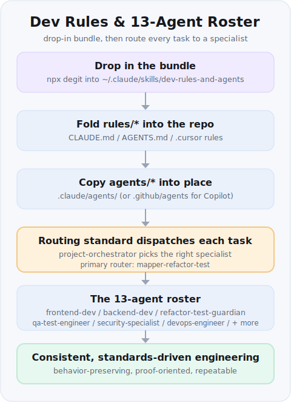

# dev-rules-and-agents

Portable **engineering rules** + a reusable **agent roster**, extracted from a real production project
(a Vite/React + .NET data-mapping tool). The roster is an **adaptable example** — keep the structure,
swap the product nouns.

This skill answers two recurring needs in one place:

1. **General rules** — coding standards, a behavior-preserving refactoring methodology, and
   session-hygiene/working-style rules — written to be project-agnostic and droppable into any repo.
2. **Agents** — 13 specialist subagent definitions (one source, down-converts to Claude / Copilot /
   Cursor) plus a routing and standards guide.

## Install

Add the bundle to your **global** Claude skills folder so it's available in every repo:

```bash
npx degit Kaidanov/grekai-skills-4all/skills/dev-rules-and-agents ~/.claude/skills/dev-rules-and-agents
```

- **Project-scoped instead?** Use `.claude/skills/dev-rules-and-agents` to commit it with one repo.
- **No `npx`?** The [skill page](https://grekai-skills-4all.vercel.app/skill?id=dev-rules-and-agents)
  shows a `git sparse-checkout` alternative.

This skill is a library you draw from rather than a script you run — see **Use it** for how to apply
the rules and agents to a project.

## Contents

| Path | Purpose |
|---|---|
| `rules/coding-rules.md` | General coding rules — working style, code quality, safety, docs. |
| `rules/refactoring-rules.md` | Behavior-preserving dedup/consolidation methodology (done = proven). |
| `rules/working-style.md` | Session hygiene — proof artifacts, token economy, handoffs, commits, TLDR report. |
| `agents/README.md` | Agent roster + how to invoke in Claude / Copilot / Cursor. |
| `agents/ARCHITECTURE_AND_STANDARDS.md` | Routing order, activation rules, agentic loops, token + pruning standards. |
| `agents/*.md` | 13 agent definitions (Claude-style frontmatter). |

## Use it



- **As a baseline for a new repo:** fold `rules/*` into the project's `CLAUDE.md` / `AGENTS.md`, and
  copy `agents/*.md` into `.claude/agents/` (and transform to `.github/agents/*.agent.md` for Copilot).
- **From a prompt:** point your assistant at this folder — "follow `rules/refactoring-rules.md`" or
  "use the `refactor-test-guardian` agent from `agents/`".

## Example

Routing dispatches a task to the right specialist(s) instead of one do-everything prompt:

```text
task: "add a rate limiter to the upload endpoint"
  → project-orchestrator breaks it down
  → backend-dev      (implement the limiter in the .NET service)
  → security-specialist (validate trust boundary, no bypass, secrets)
  → qa-test-engineer (xUnit proof for the changed behavior)

task: "tighten the canvas dialog spacing"
  → ui-ux-designer  (tokens + a11y) → frontend-dev (wire it)

Each agent is a plain Markdown file with Claude-style frontmatter:

---
name: refactor-test-guardian
description: Use this agent for refactoring and targeted test validation. It
  researches current code, applies minimal fixes, runs focused build/test proof,
  and updates repo memory with stable facts.
rules:
  - Reuse existing code and tests before creating new ones
  - Prefer the smallest viable diff with the narrowest meaningful validation
---
System prompt / behavior goes here.
```

See `SKILL.md` for the full how-to.

> The **rules are generic**; the **agents are an adaptable example roster** specialized for one product
> (a Vite/React + .NET XSLT data-mapping tool). They're included as a real, working reference — keep the
> structure and swap the product-specific nouns (paths, stack, domain) when reusing elsewhere.
