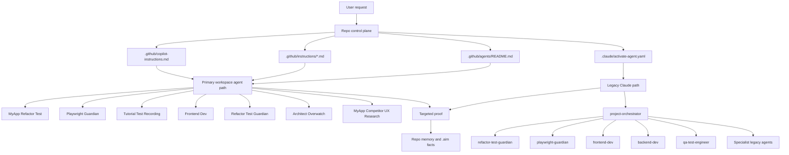
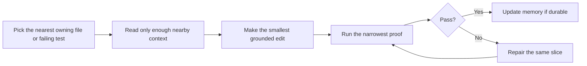
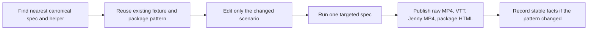
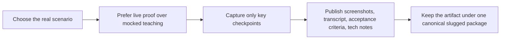
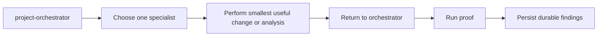

# Agent Architecture And Standards

Canonical guide for agent routing, activation, autonomous work, agentic loops, and low-token usage in this repo.

## Current Decision On Stale Agents

- No safe agent removals are recommended today.
- `.github/agents` is the active, repo-authoritative agent set for VS Code Copilot Chat.
- `.claude/agents` is legacy, but it is still intentionally wired through `.claude/activate-agent.yaml` and `project-orchestrator`.
- That makes the Claude set legacy fallback, not dead inventory.
- Future cleanup should happen only as one explicit retirement step for the Claude path, not by deleting random individual legacy agents.
- Plan and use the less possible amount of tokens with fastest way to the goal but with the most quality of solution. If you need to use an agent, use the one that is most likely to achieve the goal with the least amount of tokens. Do not use multiple agents if one can do the job. Always start with the nearest concrete anchor and make the smallest grounded edit first, then run the narrowest proof immediately after. Update durable facts when a workflow or architecture rule becomes durable.
- Make sure to remove unneeded files and stale code patterns as part of the execution, but do so in a nondestructive way with search/build/test gates before every move. Use confidence tiers for cleanup: generated outputs first, provably unused code second, docs/examples later, tooling/config last.
- Make sure to remove stale sql migrations and create scaffold orderly and clear run for new isntalaations of the db for others. 

## Architecture

## Primary Activation Order

Use this order unless the task clearly starts somewhere else.

1. `MyApp Refactor Test`
2. `Playwright Guardian`
3. `Tutorial Test Recording`
4. `Frontend Dev`
5. `Refactor Test Guardian`
6. `Architect Overwatch`
7. `MyApp Competitor UX Research`

## Primary Workspace Agents

| Agent | What it owns | Activate it when | Do not start here when |
|---|---|---|---|
| `MyApp Refactor Test` | Default MyApp implementation and proof coordinator | The task is a normal MyApp fix, refactor, validation change, browser proof update, or small doc-and-proof cycle | The task is purely a deep narrated tutorial package or pure competitor research |
| `Playwright Guardian` | Generic Playwright upkeep and narrated browser evidence | You need to create or repair a Playwright spec, keep pre-commit browser proof green, or publish a narrated acceptance package | The main deliverable is a long teaching walkthrough with deep explanation across many stages |
| `Tutorial Test Recording` | Rich narrated tutorial packages | You need tutorial MP4, captions, screenshots, walkthrough HTML, transcript, acceptance sections, and training-style explanation | The task is only a stale selector fix or a small browser regression proof |
| `Frontend Dev` | Focused client implementation | The request is clearly browser-side UI, canvas, dialog, picker, state, or component behavior | The task is cross-layer and needs a coordinator |
| `Refactor Test Guardian` | Small inspect-refactor-validate loops | The request is a narrow repair, god-file split, or focused regression proof | The task is primarily tutorial or architecture review |
| `Architect Overwatch` | Boundary and structure review | The task changes ownership, module boundaries, contracts, scalability, or system design | The task is just a local bug fix |
| `MyApp Competitor UX Research` | Vendor-doc and product-pattern research | The request is competitive UX, Altova/XMLSpy comparison, or drift analysis with correction notes | The task is implementation or proof only |

## Legacy Claude Agents

These are fallback or specialist agents for the `.claude` path. They are not the default starting point for normal VS Code Copilot Chat work.

### Core Legacy Execution Path

| Agent | Capability |
|---|---|
| `project-orchestrator` | Coordinates the full legacy Claude path and routes to the smallest needed specialist set |
| `refactor-test-guardian` | Default Claude-side small change plus targeted proof loop |
| `playwright-guardian` | Legacy Claude fallback for Playwright creation, repair, and narrated acceptance evidence |
| `frontend-dev` | Browser-side MyApp client implementation |
| `backend-dev` | MyApp API, service, validation, and persistence work |
| `qa-test-engineer` | Validation depth and residual-risk reporting |
| `tutorial-test-recording` | Legacy Claude fallback for rich tutorial artifacts |
| `architect-overwatch` | Cross-system structure and design review |
| `mapper-competitor-ux-research` | Competitor UX and product-pattern research |

### Extended Legacy Specialists

| Agent | Capability |
|---|---|
| `ui-ux-designer` | UX refinement, layout clarity, accessibility, and polished interface behavior |
| `security-specialist` | Auth, secrets, trust boundaries, upload safety, and secure CI/CD concerns |
| `database-architect` | Schema, SQL, migrations, and performance-sensitive data design |
| `api-integration-manager` | Third-party APIs, webhooks, schema transforms, and tokenized external integrations |
| `devops-engineer` | CI/CD, environments, containerization, deployment, and observability |
| `team-lead` | Execution prioritization, scope alignment, and task coordination |
| `scrum-manager` | Sprint planning, backlog sequencing, and delivery workflow management |
| `release-automation` | Final verification, PR creation, release, and rollback-tag handling |
| `ai-ml-specialist` | Model-driven extraction, classification, recommendation, or anomaly workflows |
| `Docs Chat Coverage` | Specialized end-to-end proof for a docs-site AI chat scenario |

## Proper Activation Rules

### VS Code Copilot path

- Start from `.github/agents` unless the runtime explicitly requires the Claude path.
- Do not ask the user to choose an agent when the route is clear.
- Default to one primary agent, then add at most one specialist only after a real boundary is proven.

### Claude legacy path

- Enter through `.claude/activate-agent.yaml`.
- Let `project-orchestrator` decide the first useful split.
- Prefer workspace-first agents when the runtime can invoke them directly.

### Best entry points for testing and tutorials

- Generic browser regression or pre-commit proof: `Playwright Guardian`
- Rich narrated tutorial and training artifact: `Tutorial Test Recording`
- Mixed code-change plus proof loop: `MyApp Refactor Test`

## Canonical Low-Token Testing And Tutorial Path

Use these first before inventing new specs or packages.

1. Reuse `client/tests/<example>-deleteinner-builder-step-by-step.spec.ts` as the working ground-zero tutorial and narrated proof shape.
2. Reuse `client/tests/importsku-translation-tutorial.spec.ts` as the canonical alternate tutorial and translation-file proof shape.
3. Reuse `client/tests/test-helpers/tutorialArtifacts.ts` for shared VTT, timeline, script, and package-side helper logic.
4. For XSLT-import browser proof, prefer `window.__mapperPlaywrightBridge?.setXsltEditorContent(...)` plus `Apply Changes`.
5. Let `client/tests/global-teardown.ts` generate the Jenny MP4 from `<publishedSlug>-narration.vtt` instead of hand-running a second custom pipeline.
6. Keep `client/tests/<example>-zero-to-approved-v5.spec.ts` only as the faster approved-XSLT restore proof when you do not need the full ground-zero construction tutorial.

## Agentic Loops

### 1. Refactor-plus-proof loop

### 2. Playwright proof loop

### 3. Tutorial recording loop

### 4. Legacy Claude orchestration loop

## Autonomous Work Standards

- Decide the route automatically when the task shape is clear.
- Prefer one narrow agent over a multi-agent burst.
- Escalate only after the current agent hits a real boundary.
- Start from the nearest concrete anchor: file, spec, failing command, or owning abstraction.
- Make the smallest grounded edit first.
- Run the narrowest available proof immediately after the first substantive edit.
- Keep summaries short and outcome-first.
- When a workflow or architecture rule becomes durable, add a short new note under `memories/repo/`. Do NOT append to the archived `.aim/project-knowledge-facts.md`.

## Token Usage Standards

### Default rules

- Use one primary agent unless the task proves it needs another.
- Prefer targeted file reads over broad repo tours.
- Prefer exact searches over repeated exploratory searches.
- Reuse canonical specs, fixtures, and helpers instead of creating parallel variants.
- Use local repo inspection and local tests before MCP or web fetches.
- Only generate narrated packages when the user actually needs tutorial or acceptance artifacts.

### Practical minimization tactics

- Start with `MyApp Refactor Test` for most repo work; let it delegate instead of manually calling several specialists upfront.
- Use `Playwright Guardian` for ordinary browser proof work; use `Tutorial Test Recording` only when tutorial richness is part of the deliverable.
- For browser validation, run one focused spec, not the whole suite.
- For docs, add one canonical guide and link to it instead of duplicating the same routing rules in many places.

## Pruning Standard For Future Agent Removal

An agent is safe to remove only when all of the following are true:

1. No activation file points at it.
2. No README or routing doc still treats it as active.
3. Its capability is fully covered by another retained agent.
4. It has no unique workflow or external runtime dependency.
5. A replacement route is documented before deletion.

## Current Recommendation

- Keep all current `.github/agents` files.
- Keep `.claude/agents` until the repo explicitly retires `.claude/activate-agent.yaml` and the legacy Claude workflow.
- If the repo later drops the Claude path, retire the legacy set as one planned cleanup wave instead of piecemeal deletions.