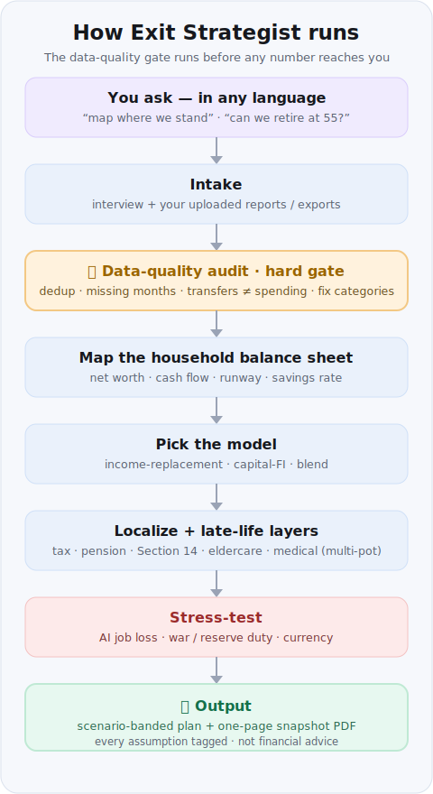

# Exit Strategist — Honest Money-Independence & Early-Retirement Planning

Turns the viral *"I handed an AI my salary and it told me I was 6 months from never needing one
again"* threads into plans a careful adult can actually act on — and goes far beyond them. It runs
the recognizable questions, but strips the hustle-culture fantasy and rebuilds everything around
realism, a full **household** balance sheet, your country's tax/pension/safety-net reality,
**data-quality auditing of real exports**, and stress tests for the income you might *not* keep
(AI job loss, war, reserve duty).

> **Not financial, tax, or legal advice.** Structured thinking using your own numbers. Confirm
> anything binding — resignation, tax, pension, investing, relocation — with a licensed
> professional in your country. The skill says this in its own output too.

*🇮🇱 גרסה עברית [בהמשך](#עברית--תקציר).*

## What it's for (use-case map)

| # | Use case | Use it when… |
|---|----------|--------------|
| 1 | **Salary-exit / quit the 9-5** | You want to replace your salary with income outside the job |
| 2 | **FI / early retirement** | You want to retire early on capital (full FI, Coast-FI, Barista-FI) |
| 3 | **Job-loss resilience** | You're facing a layoff or AI displacement and need a floor |
| 4 | **Current-state mapping → PDF** *(sub-skill)* | You want a clear one-page snapshot of where you stand, from an interview + your uploaded reports |
| 5 | **Spending optimization** | You want to know where to cut — from a real transaction export |
| 6 | **Macro / relocation resilience** | War, reserve duty, currency, or a possible relocation change the math |

The **current-state map (#4)** is the foundation; the others run better once it exists. Any time a
financial **export** is involved (#4, #5), the **data-quality audit runs first** — because raw
exports lie (mislabeled categories, transfers tagged as spending, missing months that halve every
figure).

## How it runs (the pipeline)

Whatever you ask, the skill routes through the same honest pipeline — the data-quality gate comes
**before** any number reaches you:



In words: **you ask → intake (interview + reports) → 🚦 data-quality audit → map the balance sheet →
pick the model → localize + late-life layers → stress-test → output.** The audit is a hard gate:
no number is used until the export is cleaned.

## How it fits together (what's inside)

| Area | What it covers |
|---|---|
| **Honesty contract** | No fabricated certainty · base rates beat vibes · downside before upside · not financial advice |
| **Current-state map** | Interview · document ingestion · data-quality audit · one-page PDF |
| **Models** | Income replacement · early retirement (full FI / Coast-FI / Barista-FI) · blend |
| **Stress tests** | AI displacement · war / reserve duty · currency / relocation |
| **Late-life layers** | Pension current-vs-projected · eldercare from home equity · medical & dental · child support |
| **Localize** | Tax & self-employment · safety net & severance · Section 14 · pension continuity |

## Short version

1. **Map where you stand** (interview + your reports, after a data-quality audit) → a one-page
   snapshot with net worth, cash flow, and required immediate-savings recommendations.
2. **Pick the model** — replace income, retire on capital, or a blend.
3. **Localize** the tax, safety-net, pension and (Israel) Section 14 reality.
4. **Add the late-life layers** — pension current-vs-projected, eldercare, medical, child support —
   via a multi-pot model so they don't compete for one asset.
5. **Stress-test** against AI job loss and macro shocks, then output a scenario-banded plan.

## Worked example (abridged)

> *"I'm 47, probably losing my job, wife earns less than me, two teens, mortgage, an inherited
> half-apartment. Can we retire at 55?"*

The skill: audits the uploaded bank export (finds mislabeled "coffee" transfers and 6 missing
months, rebuilds real categories) → maps net worth split into liquid vs locked vs real estate →
notes pension **projected** balance and annuity differ hugely from the **current** balance → runs
the **early-retirement** model and finds full FI at 55 is short but **Barista-FI at 55 / full at
~58–60** works → applies the **multi-pot** model (portfolio = living + the bridge to the annuity;
home = eldercare reserve; inherited half-apartment = children) → lists **immediate monthly savings**
from the corrected categories → flags Section 14 (severance owed regardless) and the missing data
(spouse's pension) to verify. Output: a one-page snapshot PDF + a short early-retirement strategy,
in Hebrew, with every assumption tagged.

## Example outputs

These are illustrative, abridged samples of what the skill returns (numbers are fictional). Real
runs are in the user's language and currency.

### 1) The data-quality audit (runs first, before any advice)

```text
DATA-QUALITY AUDIT — bank_export_2024.csv
Span: 2023-01 -> 2024-06 (18 months) · 2,914 rows

Removed / corrected before analysis:
  - Duplicates ......... 41 rows (₪7,820) — same purchase on max sub-card + cal
  - Transfers as spend . ₪6,350/mo recurring tagged "coffee" -> confirmed inter-account transfer (excluded)
  - Income as spend .... ₪12,700 one-off tagged "coffee" -> salary bonus (excluded)
  - Mislabeled ......... ₪10,000 tagged "internet" -> mortgage overpayment (moved to liabilities)
  - Missing months ..... "groceries" present in only 11 of 18 months -> normalized on ACTIVE months

Confidence: MEDIUM. Spouse's pension export not provided; entertainment looks under-reported.
-> Rebuilt categories below replace the app's broken buckets. All figures use corrected numbers.
```

### 2) The one-page snapshot / exit plan (excerpt)

```text
# Your Exit Plan — solid base, but "retire at 55" is a stretch; 58–60 is real

## Where you actually stand
  Net worth ............ ₪2.84M  (liquid ₪410k · locked/pension ₪930k · real-estate equity ₪1.5M)
  After-tax surplus .... ₪3,200 / mo  (household, with spouse income as the anchor)
  True runway .......... 7.6 months of essentials from liquid assets
  Savings rate ......... 14%  (was reported as 22% before the audit corrected transfers)

## Your number(s)
  Floor (essentials − spouse income) ... ₪9,400 /mo after tax
  Goal (full lifestyle) ................ ₪16,800 /mo after tax
  FI target capital .................... ₪5.0M  ·  Coast-FI hit (yes)  ·  Barista-FI at 55 (yes)

## The realistic timeline
  Conservative: full FI ~60   |  Base: 58   |  Stretch: 56
  -> Full retirement at 55 is short by ~₪900k. Barista-FI at 55 (₪6k/mo bridge work) closes it.

## Do this in the next 7 days
  1. Pull spouse's pension (Har Habituach) — biggest missing number.
  2. Confirm Section 14 status with HR — severance is owed regardless of how you leave.
  3. Redirect the ₪6,350 "coffee" transfer into the brokerage bridge fund.

## Honest caveats
  Not financial/tax/legal advice. Assumes 3.5% SWR, 2.5% inflation, employment to plan date.
  Confirm pension, tax registration, and Section 14 with a licensed professional in Israel.
```

## Install

```bash
npx degit Kaidanov/grekai-skills-4all/skills/exit-strategist .claude/skills/exit-strategist
```

## Use

Ask your assistant in any language: *"map where we stand"*, *"can we retire early?"*, *"where can
we cut?"*, *"I'm about to lose my job"*, or paste a viral 7-prompt thread. It picks the use case,
audits any uploaded export **first**, maps the household balance sheet, localizes the tax/pension
reality, stress-tests AI/macro risk, and outputs a scenario-banded plan or a one-page snapshot.

## Files

- `SKILL.md` — the workflow.
- `references/current-state-mapping.md` — the interview + documents → one-page PDF sub-skill.
- `references/data-quality.md` — the hard-gate audit for real financial exports.
- `references/early-retirement-fi.md` — the capital / FI model (SWR, Coast-FI, Barista-FI).
- `references/base-rates.md` — realistic time-to-revenue and success rates.
- `references/country-profiles.md` — localization (Israel worked + US/UK/EU/India + template).
- `references/blind-spots.md` — hard gates and plan-killers (visa, non-compete, Section 14, etc.).
- `references/ai-displacement.md` — AI/automation exposure stress test.
- `references/macro-and-relocation.md` — war/reserve-duty/currency shocks + relocation strategy.

## Privacy & disclaimer

The skill **never accepts, stores, or echoes national ID numbers** or full account numbers — users
run official portals (e.g. Israel's הר הביטוח / הר הכסף) themselves and paste only the numbers.
Personal output PDFs are the user's private files and are never committed to this repo. Structured
planning only — **not financial, tax, or legal advice.**

---

## עברית — תקציר

**אסטרטג היציאה** הופך את הטרנד הוויראלי (*"נתתי ל-AI את המשכורת שלי והוא אמר שאני חצי שנה מחופש
כלכלי"*) לתוכנית שמבוגר אחראי באמת יכול לפעול לפיה. הוא מריץ את אותן שאלות מוכרות, אבל מסיר את אשליית
"תרבות ההאסל" ובונה הכול מחדש סביב ריאליזם, **מאזן משק-בית** מלא, מציאות המס/הפנסיה/רשת-הביטחון
המקומית, **ביקורת איכות-נתונים על ייצוא אמיתי**, ומבחני-עומס להכנסה שאולי *לא* תישמר (אובדן עבודה
ל-AI, מלחמה, מילואים).

> **לא ייעוץ פיננסי, מס או משפטי.** חשיבה מובנית על בסיס המספרים שלך. כל החלטה מחייבת — התפטרות, מס,
> פנסיה, השקעות, רילוקיישן — אַמְּתו מול בעל מקצוע מורשה במדינתכם. הכישור אומר זאת גם בפלט שלו.

**למי זה מתאים (מפת שימושים):**

| # | תרחיש | מתי להשתמש |
|---|-------|-----------|
| 1 | **יציאה מהשכר / לעזוב את ה-9-5** | להחליף את המשכורת בהכנסה מחוץ לעבודה |
| 2 | **עצמאות כלכלית / פרישה מוקדמת** | לפרוש מוקדם על בסיס הון (FI מלא, Coast-FI, Barista-FI) |
| 3 | **חוסן מול אובדן עבודה** | פיטורים או החלפה ע"י AI — צריך רצפת ביטחון |
| 4 | **מיפוי מצב נוכחי ← PDF** *(תת-כישור)* | תמונת-מצב בעמוד אחד מתוך ראיון + הדוחות שהעליתם |
| 5 | **ייעול הוצאות** | איפה לקצץ — מתוך ייצוא תנועות אמיתי |
| 6 | **חוסן מאקרו / רילוקיישן** | מלחמה, מילואים, מטבע או רילוקיישן משנים את החשבון |

**איך זה עובד (בקצרה):**

1. **ממפים איפה אתם עומדים** (ראיון + הדוחות שלכם, אחרי ביקורת איכות-נתונים) ← תמונת-מצב בעמוד אחד:
   שווי נקי, תזרים, והמלצות חיסכון מיידיות.
2. **בוחרים מודל** — החלפת הכנסה, פרישה על הון, או שילוב.
3. **מתאימים לוקלית** את מציאות המס, רשת-הביטחון, הפנסיה וסעיף 14 (ישראל).
4. **מוסיפים שכבות אורך-חיים** — פנסיה נוכחית מול תחזית, סיעוד, רפואה/שיניים, מזונות — במודל
   "סירים נפרדים" כדי שלא יתחרו על אותו נכס.
5. **מבחן-עומס** מול אובדן עבודה ל-AI וזעזועי מאקרו, ואז פלט תוכנית עם טווחי-תרחיש.

**פרטיות:** הכישור **לעולם לא מקבל, שומר או מציג מספרי תעודת-זהות** או מספרי חשבון מלאים — אתם מריצים
בעצמכם את הר הביטוח / הר הכסף ומדביקים רק את המספרים. **לא ייעוץ פיננסי, מס או משפטי.**

> הכישור עובד בכל שפה — פשוט פנו אליו בעברית ("תמפה איפה אנחנו עומדים", "אפשר לפרוש ב-55?",
> "איפה כדאי לקצץ?", "אני עומד לאבד את העבודה") והפלט יחזור בעברית.
