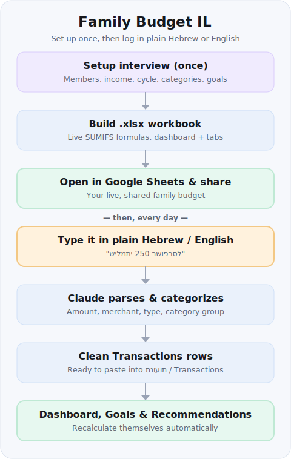

# Family Budget Planner (Israel-first) 🇮🇱

Build a **shared, Google-Sheets-ready family budget workbook**, then keep it
current by **typing expenses in plain Hebrew or English** — no bank
connections, no app to install, no data uploads.

Defaults to **Israel** (₪ shekels, Hebrew/RTL, Israeli categories, HMOs,
ארנונה, a **15th-to-15th salary-aligned cycle**, provident/pension funds and
benefit clubs) but adapts to any country.

## How it works — two phases



1. **Setup (once).** Claude interviews the family and generates one `.xlsx`
   workbook with live formulas. You upload it to Google Drive → *Open with
   Google Sheets* → *Share* with the family. That sheet is now your live,
   shared budget.
2. **Logging (ongoing, through chat).** Tell Claude what happened —
   *"שילמתי 250 בשופרסל"*, *"arnona 1,247 came out today"*,
   *"salary 18,500 net"* — and it returns clean, categorized rows ready to
   paste into the **תנועות / Transactions** tab. The dashboard recalculates
   itself. With the Google Drive/Sheets connector, rows can be appended
   directly.

Plus: a **Goals** tab (required ₪/month, gap vs. surplus), a
**"where do we stand?"** cycle summary, and a **Recommendations** action board
that maps your benefit-club memberships to concrete savings.

## Example output

You type one line; Claude hands back paste-ready rows in the exact
**Transactions** column order, plus a one-line confirmation.

```text
You: שילמתי 250 בשופרסל ועוד 40 בארומה

Rows to paste into תנועות / Transactions:
Date | Member | Account | Type | Group | Category | Description | Amount | ExcludeFromBudget | Notes
2026-06-26 |  |  | expense | מזון וסופרמרקט | סופרמרקט | שופרסל | 250 | FALSE |
2026-06-26 |  |  | expense | מזון וסופרמרקט | קפה | ארומה | 40 | FALSE |

Logged ₪290 in food this cycle. Cycle balance so far: ₪7,910 of ₪18,500 spent.

Where do we stand? מזון וסופרמרקט: ₪3,460 / ₪4,000 — ₪540 left until the 15th.
```

## What's in here

| Path | Purpose |
| --- | --- |
| `SKILL.md` | The skill instructions (setup wizard, NL logging, goals, recommendations, guardrails). |
| `references/categories.md` | Bilingual Israeli category taxonomy (18 groups, ~70 categories). |
| `references/budget-logic.md` | Operating-vs-total cash flow, `ExcludeFromBudget`, credit-card reconciliation, salary cycles, savings rate, net worth. |
| `references/nl-parsing.md` | Turning Hebrew/English plain language into transaction rows; Israeli merchant→category map. |
| `references/israeli-clubs.md` | Major Israeli benefit/discount programs → savings recommendations. |
| `scripts/build_workbook.py` | Generates the Google-Sheets-ready `.xlsx` from a config JSON (all dashboard cells are live SUMIFS formulas). |
| `scripts/recalc.py` | Recalculates formulas via LibreOffice and reports any formula errors. |
| `scripts/office/soffice.py` | Minimal LibreOffice launcher helper used by `recalc.py`. |
| `assets/config.example.json` | Worked example config + schema. |

## Install

```bash
npx degit Kaidanov/grekai-skills-4all/skills/family-budget-il .claude/skills/family-budget-il
```

## Use

Just ask — *"בוא נקים תקציב משפחתי"* / *"set up a family budget"* — and Claude
runs the setup wizard, then builds the workbook:

```bash
python scripts/build_workbook.py --config budget_config.json --out family_budget.xlsx
python scripts/recalc.py family_budget.xlsx   # verify zero formula errors
```

Requires Python with `openpyxl`; `recalc.py` additionally needs LibreOffice
(`soffice`) on the PATH.

## Guardrails

- Never stores account/card numbers, passwords, or credentials — labels and
  last-4 only.
- Keeps every workbook formula error-free (no `#REF!` / `#DIV/0!` / `#VALUE!`).
- Never fabricates current club discounts or fund yields — searches first.
- Not financial advice; pension/provident-fund questions hand off to the
  `gemelnet-advisor` skill.
