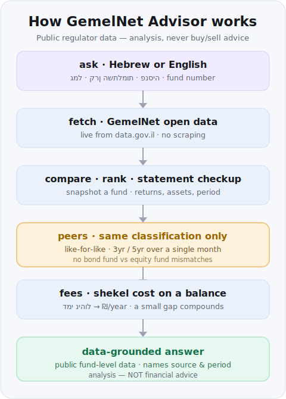

# GemelNet Advisor — Israeli Pension Funds

Query and analyse Israeli **provident (קופת גמל)**, **study (קרן השתלמות)**,
**investment-provident (גמל להשקעה)** and **pension** funds using the official
**GemelNet** open dataset on [data.gov.il](https://data.gov.il). Search funds,
compare them, rank one against its like-for-like peers, scan a statement into a
portfolio checkup, and estimate the shekel cost of management fees.

> **Not financial advice.** This skill reports *historical, public, fund-level*
> data and frames it as analysis — never buy/sell/switch recommendations. It uses
> no personal data and ships no secrets.



## What it does

- **Search** funds by name or managing company (Hebrew or English).
- **Snapshot** a single fund: returns (monthly / YTD / 3yr / 5yr), management fee,
  classification, assets, report period.
- **Compare** several funds side by side and flag the best return / lowest fee.
- **Rank** a fund against the peers in its own GemelNet classification.
- **Revenue/cost** — estimate the annual shekel cost of the management fee on a
  given balance.
- **Statement scan** — turn a pasted/uploaded statement into a per-holding
  checkup (snapshot + peer rank + fee cost).

## Why it works this way

- **Regulator data, live.** Figures come straight from the Capital Market
  Authority's GemelNet dataset via the data.gov.il CKAN API — no scraping, no
  hand-maintained copy of the numbers.
- **Standard library only.** The core engine (`scripts/gemelnet.py`) imports
  nothing outside Python's stdlib, so there is no dependency file to install.
  The optional `scan --pdf` path uses `pdfplumber` / `pypdf` / `pdftotext` *if*
  present and degrades gracefully if not.
- **Like-for-like by design.** Rankings only compare funds in the same
  `FUND_CLASSIFICATION`; the skill refuses to pit a bond fund against an equity
  fund.

## Install

Download just this skill into your project's `.claude/skills/` folder:

```bash
npx degit Kaidanov/grekai-skills-4all/skills/gemelnet-advisor .claude/skills/gemelnet-advisor
```

No `npx`? Use git sparse-checkout instead:

```bash
git clone --depth 1 --filter=blob:none --sparse https://github.com/Kaidanov/grekai-skills-4all.git
cd grekai-skills-4all
git sparse-checkout set skills/gemelnet-advisor
cp -r skills/gemelnet-advisor <your-project>/.claude/skills/gemelnet-advisor
```

There is **no `requirements.txt`** — the core needs only Python 3.8+.

### Optional: enable the auto-trigger hook

Wire the bundled `UserPromptSubmit` hook so Claude Code suggests this skill
whenever a prompt mentions Israeli-pension keywords (Hebrew or English). Add to
your `.claude/settings.json`:

```json
{
  "hooks": {
    "UserPromptSubmit": [
      {
        "hooks": [
          { "type": "command",
            "command": "python3 .claude/skills/gemelnet-advisor/hooks/gemelnet-hook.py" }
        ]
      }
    ]
  }
}
```

The hook only adds context (never blocks the prompt) when it sees keywords like
`גמל`, `קרן השתלמות`, `פנסיה`, `תשואה`, `gemel`, `provident fund`, `study fund`.

## Usage

```bash
cd .claude/skills/gemelnet-advisor   # or skills/gemelnet-advisor in this repo

# Sanity check — list the dataset's resource IDs (needs network)
python3 scripts/gemelnet.py resources

# Search, snapshot, compare, rank, cost
python3 scripts/gemelnet.py funds --q "אלטשולר"
python3 scripts/gemelnet.py fund 9012
python3 scripts/gemelnet.py compare 9012 512 1234
python3 scripts/gemelnet.py rank 9012
python3 scripts/gemelnet.py revenue 9012 --balance 250000
```

Or just talk to your assistant — *"compare my study fund 9012 with its peers and
tell me what I'm paying in fees"* — and let it drive `SKILL.md`.

## Example output

Each command prints a compact table and closes with a "not advice" reminder.
A like-for-like comparison plus a fee-cost estimate looks like this (figures
illustrative; live numbers come from GemelNet):

```text
$ python3 scripts/gemelnet.py compare 9012 512 1234

       ID  Fund                                Company                     YTD          3yr         Fee
     9012  קרן השתלמות כללי                     אלטשולר שחם          YTD   6.84%   3yr   5.12%   fee  0.62%
      512  קרן השתלמות כללי                     מיטב                YTD   7.21%   3yr   5.47%   fee  0.70%
     1234  קרן השתלמות כללי                     הראל                YTD   6.30%   3yr   4.88%   fee  0.55%

  Highest 3yr return : 512 (5.47%)
  Lowest mgmt fee    : 1234 (0.55%)

Like-for-like comparison only matters within the same fund class. Not advice.

$ python3 scripts/gemelnet.py revenue 9012 --balance 250000

Fund 9012 — קרן השתלמות כללי
  Annual mgmt fee  : 0.62%
  On balance       : 250,000 ₪
  Estimated cost   : 1,550 ₪ / year (~129 ₪ / month)

Estimate from the published fee on a flat balance; ignores deposits, deposit fees and compounding. Not advice.
```

Takeaway (analysis, not advice): all three are the same study-fund class, so the
comparison is fair — fund 512 led on 3yr average-annual return while 1234 charged
the lowest fee; on a 250,000 ₪ balance the 0.62% fee on 9012 works out to roughly
1,550 ₪ a year. Past performance does not predict future results.

## Files

- `SKILL.md` — the workflow (read this to run the skill).
- `scripts/gemelnet.py` — the engine (stdlib only).
- `references/api.md` — the GemelNet dataset, CKAN API and field reference.
- `references/analysis.md` — how to read returns, fees and rankings responsibly.
- `hooks/gemelnet-hook.py` — the `UserPromptSubmit` auto-trigger.

## Data source & disclaimer

Data: **GemelNet**, the Israeli Ministry of Finance / Capital Market, Insurance &
Savings Authority open dataset, served via data.gov.il. Figures are historical and
net of fees as published by the regulator. **Past performance does not predict
future results. This is data-grounded analysis, not financial, tax or legal
advice.**
