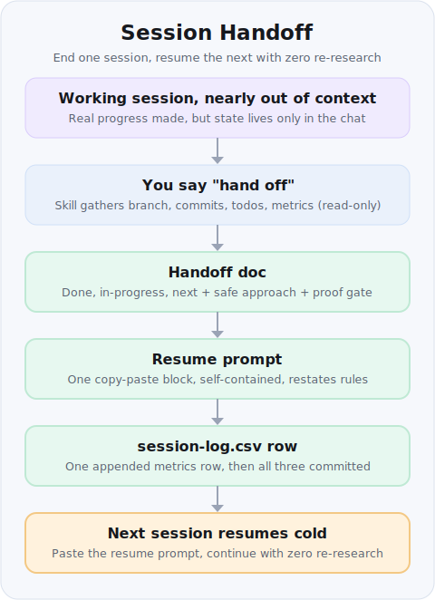

# handoff

Package the current working session into a **handoff** so the **next** session
resumes with zero re-research. It produces a dated handoff doc, a standalone
copy-paste resume prompt, and a metrics row — and syncs the shared coordination
file when a concurrent session is active.

## Install

Add the skill to your **global** Claude skills folder so it's available in every repo:

```bash
npx degit Kaidanov/grekai-skills-4all/skills/handoff ~/.claude/skills/handoff
```

- **Project-scoped instead?** Use `.claude/skills/handoff` as the target to commit it with one repo.
- **No `npx`?** The [skill page](https://grekai-skills-4all.vercel.app/skill?id=handoff) shows a
  `git sparse-checkout` alternative.

## Use it

When your session is nearly out of context, say **"hand off"** (or invoke the skill). It writes a
dated handoff doc, a standalone copy-paste resume prompt, and an appended `session-log.csv` row under
the project's `docs/handoffs/` folder, then commits them. Paste the resume prompt into your next
session to continue cold — see the pipeline below for exactly what it captures.

## Why

Long or context-bound sessions lose state when they end. Re-deriving "where were
we, what's next, what's the safe approach, what proves it works" wastes tokens
and time. This skill captures all of that **once**, in linkable artifacts, so the
next session (or a teammate) continues cold.

## When to use

Invoke at final-context steps — when budget/context is nearly exhausted, or when
the user says: *"handoff"*, *"prepare next session"*, *"hand off"*, *"wrap up the
session"*, *"switch to next session"*, *"create a resume prompt"*. Works in any
repo; it's project-agnostic.

## Contents

| File | Purpose |
| --- | --- |
| `SKILL.md` | The full skill instructions (gather → write-doc → resume-prompt → log → commit). Project-agnostic. |
| `README.md` | This overview: what/why/when + how it works. |

## What it produces (per run, under the project's `docs/handoffs/` folder)

1. `<YYYY-MM-DD>-<scope>-handoff.md` — the handoff doc, including a **Session
   metrics** block.
2. `<YYYY-MM-DD>-<scope>-resume-prompt.md` — a standalone, copy-paste resume
   prompt so you can stop now and continue later.
3. `session-log.csv` — one **appended** row per session (created with a header if
   missing) for tracking progress/cost over time.

## How it works (the pipeline)



1. **Gather** (read-only, fast) — current branch + recent commits, working-tree
   status, active trackers/plan/coordination docs, the todo list, the last known
   build/test result, memory files touched this session, and exact per-subagent
   token/duration metrics from each subagent's returned `usage` block.
2. **Write the handoff doc** — TL;DR state, Done (with commit hashes), In
   progress/locked, Next (prioritized, with a safe approach + proof gate),
   Rejected/deferred, Key facts/gotchas (linked `file:line`), How to verify
   (commands + green baseline), Coordination, Rules, and a Session-metrics block.
3. **Append `session-log.csv`** — a single metrics row (pure append, never a
   rewrite, since a concurrent session may have added rows).
4. **Write the resume-prompt** — one fenced, self-contained block the user pastes
   into the next session; it points at the handoff/coordination/tracker/memory
   paths, states the immediate next task + safe approach + proof gate, and
   restates the project's hard rules.
5. **Commit + report** — commit the three artifacts and show the user the paths +
   the resume prompt.

### Principles it honors

- **done = proven.** It records what was actually verified, not what was merely
  written. Numbers are never fabricated — totals the harness doesn't expose are
  recorded as `n/a (estimate)`.
- **Link, don't duplicate.** It links to existing docs and `file:line` rather
  than pasting large code.
- **Concurrent-safe.** Appends to the shared coordination file and commits small
  and often.

## Example output

A run writes three files under `docs/handoffs/` and commits them:

- `docs/handoffs/2026-06-26-auth-refactor-handoff.md`
- `docs/handoffs/2026-06-26-auth-refactor-resume-prompt.md`
- `docs/handoffs/session-log.csv` (one row **appended**)

Abridged handoff doc:

```text
# 2026-06-26 — auth-refactor — handoff

## TL;DR state
Mid-refactor of session handling onto the new token store. Branch green,
2 of 4 call sites migrated.

## Done (proven)
- Extracted TokenStore, behavior preserved — a1b2c3d
- Migrated login + refresh paths; typecheck+test+build green — d4e5f6a

## In progress / locked
- middleware/session.ts:42 still reads the legacy cookie (uncommitted).

## Next (prioritized)
1. Migrate logout path — src/auth/logout.ts:18
   Safe approach: mirror the refresh-path change; keep the old export until
   all callers move. Proof gate: npm test auth + npm run build green.
2. Delete legacy cookie reader once all 4 sites use TokenStore.

## Key facts / gotchas
- TokenStore is async — never call it in the sync config loader (config.ts:7).
- Build is the real gate; the typecheck cache lies after the file move.

## How to verify
  npm run typecheck && npm test auth && npm run build   # green baseline

## Session metrics
completed 2 / left 2 · commits 2 · subagent_tokens 41,330 (exact)
total tokens + time: n/a (estimate) · memory saved: memories/repo/auth.md
```

Standalone resume prompt (the block you paste into the next session):

```text
Resume the auth-refactor. Read first:
- docs/handoffs/2026-06-26-auth-refactor-handoff.md
- docs/handoffs/session-log.csv  ·  memories/repo/auth.md
Next task: migrate the logout path (src/auth/logout.ts:18) onto TokenStore.
Safe approach: mirror the refresh-path change; keep the old export until all
callers move. Proof gate: `npm test auth && npm run build` must be green.
Hard rules: behavior-preserving refactors, verify-before-merge, one commit
per item, coordinate via the shared file.
```

See `SKILL.md` for the exact step-by-step instructions and field formats.
