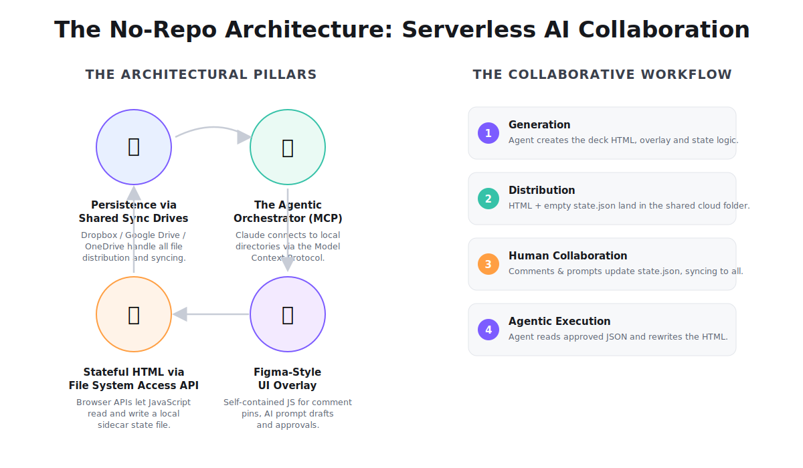
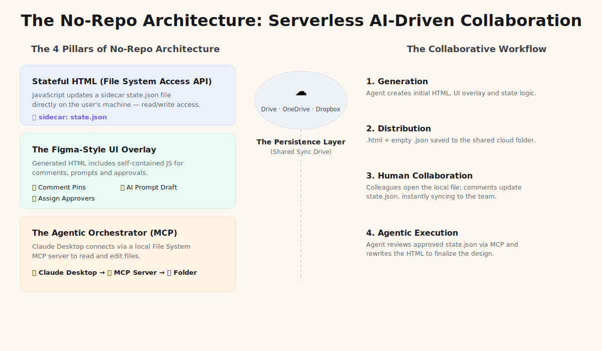
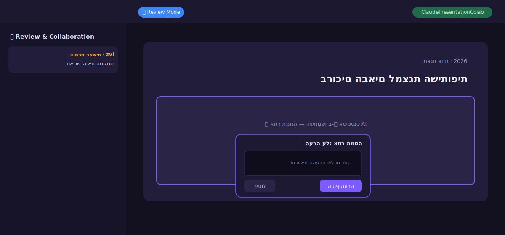
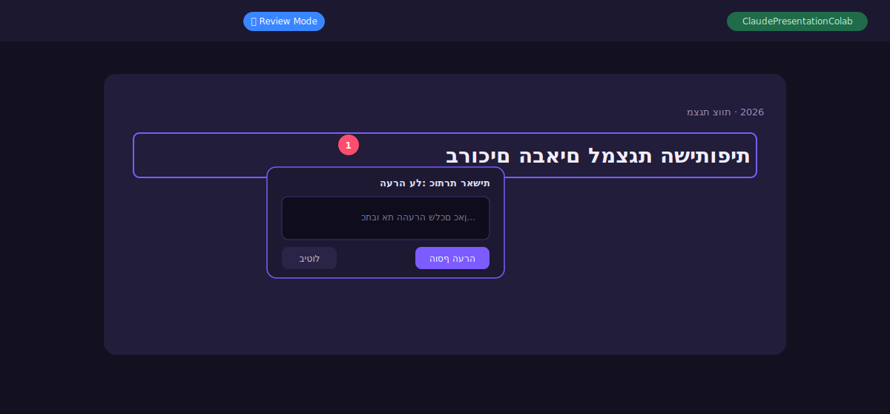
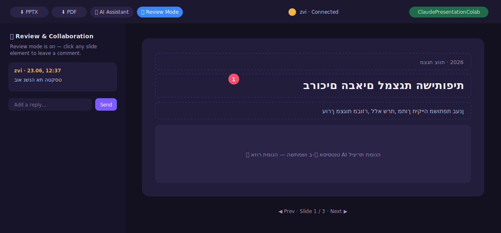
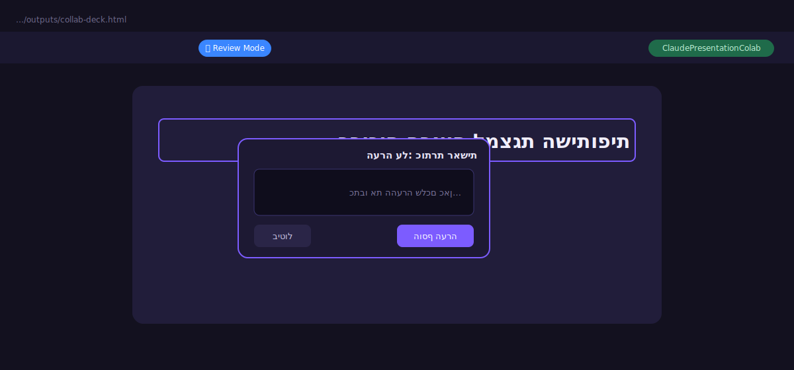

# No-Repo Collaborative Deck

A serverless, AI-driven way to collaborate on presentations (and other documents)
with **no server and no repository**. Persistence rides on a shared cloud sync folder;
a stateful HTML file reads and writes a `state.json` sidecar; an MCP agent rewrites the
source from approved changes.

## How it works

- **Stateful HTML** uses the File System Access API to read/write a sidecar `state.json`.
- **A shared cloud folder** (OneDrive / Google Drive / Dropbox) syncs that file across the team.
- **A Figma-style overlay** captures comment pins, AI prompt drafts, and approvals.
- **An MCP agent** reads the approved `state.json` and rewrites the deck HTML.

## The four architectural pillars

1. **Stateful HTML via File System Access API** — modern browser APIs grant JavaScript
   permission to read and write a local sidecar `state.json` directly on the user's machine.
2. **Persistence via shared sync drives** — standard cloud folders (OneDrive, Google Drive,
   Dropbox) handle all file distribution and syncing. No server.
3. **The Figma-style UI overlay** — the generated HTML ships self-contained JS for comment
   pins, AI prompt drafts, assigning approvers, and approvals.
4. **The Agentic Orchestrator (MCP)** — Claude connects directly to the local directory via a
   File System MCP server to read and edit files.

## The collaborative workflow

1. **Generation** — the AI agent creates the initial presentation HTML, UI overlay, and state logic.
2. **Distribution** — the `.html` file and an empty `state.json` are saved into the shared cloud folder.
3. **Human collaboration** — colleagues open the local file; comment pins and prompt drafts update
   `state.json`, which instantly syncs across the team's machines.
4. **Agentic execution** — the agent reviews the approved `state.json` via MCP and rewrites the HTML
   to finalize the design.

> **Two layers, kept separate:** the hosted URL (Vercel/Pages) is just the *player*.
> Real-time collaboration runs off the shared cloud folder (e.g. `ClaudePresentationColab`)
> that each person connects to. Hosting and the shared folder are independent.

## The collaborative deck in action

The generated deck includes a Figma-style overlay: comment pins, an inline review panel,
AI assistant, change approvals, and export to PPTX/PDF.

| Comment on the image area | Comment on the title |
|---|---|
|  |  |

> **About these images:** the diagrams and UI mocks above are committed **SVG
> recreations** so the README renders everywhere with no binary assets. To use the
> real product screenshots instead, drop PNGs into [`assets/images/`](../../assets/images/)
> and switch the extension from `.svg` to `.png` in the links above — the filenames
> already match.

## Demo

A deck demo is published under [`decks/elon-musk/`](../../decks/elon-musk/).

## Local state

Per-session sidecar state belongs in `state.local.json`, which is git-ignored — never
commit a teammate's live session state.
