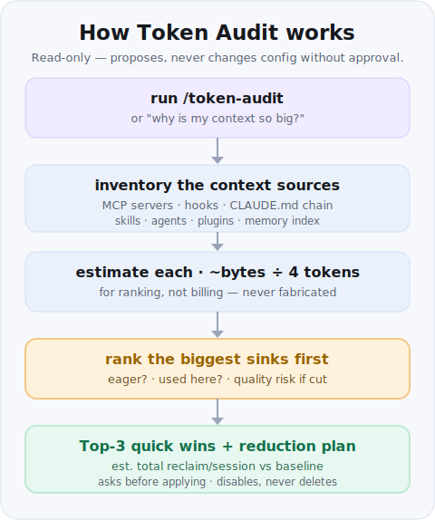

# Token Audit — cut context cost, keep quality

Your agent loads a lot **before you type a single word**: CLAUDE.md files, MCP server tool
schemas, SessionStart hooks, every installed skill's description, agent definitions, plugins,
and the memory index. Each of those is paid on *every* session. This skill finds the biggest
silent sinks and hands you a **prioritized, quality-preserving plan** to trim them.

Type `/token-audit` and it inventories your active setup, estimates each source at ~`bytes ÷ 4`
tokens, ranks them biggest-first, and gives you **Top-3 quick wins + a full table + an estimated
total reclaim** — with the quality risk of each cut spelled out so you decide, not it.

It is **read-only by default**: it proposes, it does not change your config. It only edits after
you approve (or pass `--apply`), and it never hard-deletes — it disables or backs up first.

## Prerequisites

- An agent host that supports skills — Claude Code (CLI or IDE extension) or a compatible runner.
- A shell to run the read-only inventory commands (`wc -c`, `ls`, file reads). PowerShell, bash,
  or zsh all work.
- Read access to your own config (`~/.claude/`, the project `.claude/`, `.mcp.json`, etc.). No
  network and no external services required.

## Install

It audits your **whole machine's** setup, so install it **globally**:

```bash
npx degit Kaidanov/grekai-skills-4all/skills/token-audit ~/.claude/skills/token-audit
```

Or per-project:

```bash
npx degit Kaidanov/grekai-skills-4all/skills/token-audit .claude/skills/token-audit
```

> **After installing, reload.** A skill added mid-session does **not** hot-reload into the
> slash-command picker. In VS Code: `Ctrl+Shift+P → "Developer: Reload Window"` (or restart the
> session). Then `/token-audit` appears.

## Use it

Type `/token-audit` — or ask "why is my context so big?", "what can I trim?", "reduce token usage".
You get back:

1. **Top-3 quick wins** — the highest-reclaim, lowest-risk cuts, each with the exact command/edit
   and the estimated tokens/session it saves.
2. **A ranked table** — every source (MCP servers, hooks, CLAUDE.md chain, skills, agents, plugins,
   memory) with its est tokens/session, whether it's eager, whether it's used here, and the quality
   risk of cutting it.
3. **An estimated total reclaim/session** vs your current baseline.
4. A prompt to **confirm before any change is applied**.

## How it works



## What it looks at

- **MCP servers** — eager servers inject *all* their tool schemas; this is usually the #1 sink.
  On-demand / deferred tools are cheap and are not flagged.
- **SessionStart hooks** — static "knowledge dump" injections that fire every session.
- **CLAUDE.md / AGENTS.md chain** — global + workspace + project, often with duplication.
- **Skills & plugins** — every description sits in the always-on list.
- **Agents** and the **memory index**.
- **The transcript** — long sessions are the single biggest sink; it will tell you when to start fresh.

## Example output

Abridged, illustrative — your numbers depend on your own setup. All figures are
`bytes ÷ 4` **estimates** for ranking, not billing. Nothing below is changed: this is
the read-only report you'd see *before* approving anything.

```text
/token-audit — always-on baseline for this project

Ranked sinks (biggest first)
  Source                          est. tokens   % of context
  ------------------------------  -----------   ------------
  MCP: airtable (eager, unused)       ~4,200          34%
  SessionStart hook: platform dump    ~2,600          21%
  CLAUDE.md (global + project)         ~1,900          15%
  skill: descript (never used here)      ~520           4%
  + 11 smaller sources                 ~3,180          26%
  ------------------------------  -----------   ------------
  TOTAL est. always-on baseline      ~12,400         100%

Top 3 quick wins  (highest reclaim, lowest quality risk)
  1. Disable eager MCP "airtable" — not called in this repo.
     → reclaim ~4,200 tok/session · risk: none here · `claude mcp disable airtable`
  2. Gate the SessionStart "platform dump" hook to repos that use it.
     → reclaim ~2,600 tok/session · risk: low · edit settings.json matcher
  3. Dedup global vs project CLAUDE.md (~6 overlapping lines).
     → reclaim ~700 tok/session · risk: none · keep global lean

  Estimated total reclaim: ~7,500 tok/session (~60% of baseline).

Read-only — nothing changed. Reply "apply 1,2" to action specific wins
(MCP servers are disabled, not deleted; CLAUDE.md is backed up first).
```

## Notes

- All numbers are `bytes ÷ 4` **estimates** — useful for ranking, not for billing.
- It won't tell you to cut something you actually use just because it's large — the quality column
  is there to keep the decision yours.
- Pairs with the [`tldr`](../tldr/) skill: `token-audit` trims the always-on baseline; `/tldr`
  reports your actual spend per turn.
- Generic by design — no project, org, or user names — so it's safe to publish and reuse anywhere.
