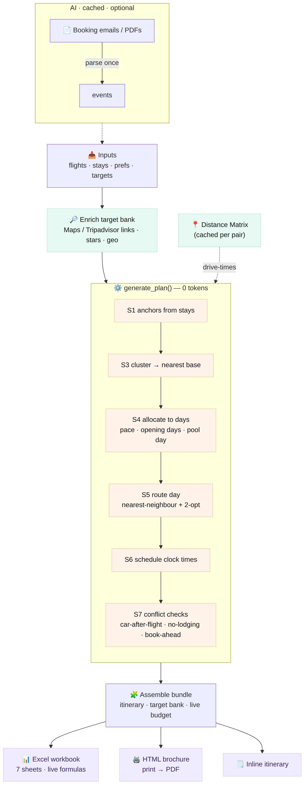
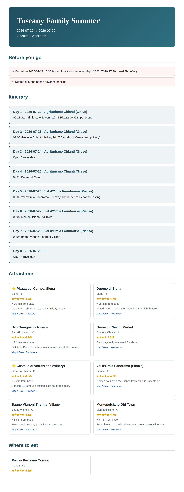
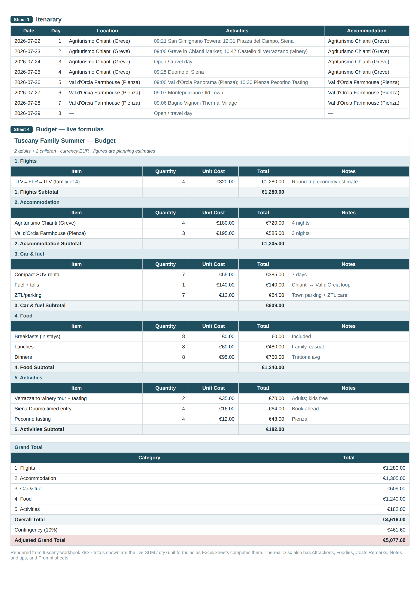

# Trip Planner — deterministic itinerary engine (Claude skill + MCP + hooks) ✈️

Generic, **destination-agnostic** trip planner. Turn initial trip data (flight
dates, accommodation stays, preferences) into a full plan: a day-by-day
**itinerary**, a scored **target bank** of attractions / restaurants / wineries /
shopping (stars, reviews, photos, map links, distance-from-base), a 7-sheet
**Excel workbook**, and a printable **HTML brochure**.

The core is **deterministic** — the model runs at most twice per trip (parse
booking docs → events; write short blurbs). Everything else — anchors,
clustering, day allocation, routing, scheduling, conflict checks, distances,
links — is pure algorithm + cached API calls = **0 tokens**.


## The pipeline

The model is only ever asked to (a) parse unstructured booking emails/PDFs into
events and (b) write a handful of short blurbs. Both are cached. Everything
inside `generate_plan()` is algorithm + cached Maps APIs:



> Source: [`assets/pipeline.mmd`](./assets/pipeline.mmd) (Mermaid). Re-render with
> `mmdc -i assets/pipeline.mmd -o assets/pipeline.png`.

## Example output

A complete worked example lives in [`examples/`](./examples/) — an 8-day Tuscany
family trip (2 adults + 2 kids), built end-to-end by
[`examples/build_example.py`](./examples/build_example.py) with **no API key and
zero tokens** (offline link-only enrichment + haversine distances).

| Stage | File |
| --- | --- |
| Input trip | [`examples/tuscany-trip.json`](./examples/tuscany-trip.json) |
| Assembled bundle | [`examples/tuscany-bundle.json`](./examples/tuscany-bundle.json) |
| **Excel workbook** (7 sheets, live formulas) | [`examples/tuscany-workbook.xlsx`](./examples/tuscany-workbook.xlsx) |
| **HTML brochure** (print → PDF) | [`examples/tuscany-brochure.html`](./examples/tuscany-brochure.html) |

### Brochure (rendered)

A self-contained HTML brochure: cover, "before you go" warnings, day-by-day
itinerary, and attraction / foodie cards with stars, distance-from-base and
Map / Reviews links.



### Workbook (rendered)

Two of the seven sheets — the Itinerary and the live-formula Budget (every
subtotal and grand total is a real `SUM` / `qty×unit` formula, so editing any
cell recomputes the sheet in Excel or Google Sheets).



### Conflict checks (caught automatically)

The example deliberately surfaces the engine's rule table — two warnings appear
at the top of every output:

- `CAR_AFTER_FLIGHT` — the rental car is returned too close to the homebound
  flight (needs a 3 h airport buffer).
- `BOOK_AHEAD` — the Siena Duomo is tagged `needs_booking` and isn't booked yet.

Rebuild everything yourself:

```bash
pip install openpyxl
python examples/build_example.py        # → bundle.json, .xlsx, .html in examples/
```

## Layout

| Path | Purpose |
| --- | --- |
| `SKILL.md` | The skill (workflow + triggering). |
| `scripts/engine.py` | Anchors, clustering, day allocation, NN+2-opt routing, scheduling, conflict checks. `generate_plan(trip) -> bundle`. |
| `scripts/enrich.py` | Map/Tripadvisor/Reviews links always; Google Places + Distance Matrix if `GOOGLE_MAPS_API_KEY` is set; disk cache. |
| `scripts/generate_workbook.py` | 7-sheet `.xlsx` (Itinerary, Attractions, Foodies, Budget w/ live formulas, Costs Remarks, Notes and tips, Prompt). |
| `scripts/generate_brochure.py` | Self-contained HTML brochure (print → PDF). |
| `mcp/server.py` | The same engine exposed as MCP tools (FastMCP / stdio). |
| `hooks/hooks.json` | Auto-rebuild outputs when a trip bundle changes; nudge the skill on travel prompts. |
| `assets/trip_template.json`, `assets/bundle_schema.json` | Input + output contracts. |
| `assets/pipeline.mmd` / `.svg` / `.png` | The Mermaid pipeline diagram. |
| `references/ENGINE.md` | Full algorithm reference (anchors, clustering, allocation, routing, scheduling, conflict rules, caching, collaboration). |
| `examples/` | Worked Tuscany trip → bundle, workbook, brochure + previews. |

## Install

```bash
npx degit Kaidanov/grekai-skills-4all/skills/trip-planner .claude/skills/trip-planner
```

## Quickstart

```bash
pip install openpyxl                # + mcp[cli], requests for the server / online mode
python scripts/engine.py trip.json > bundle.json
python scripts/generate_workbook.py bundle.json trip.xlsx
python scripts/generate_brochure.py bundle.json trip.html
```

Online enrichment (stars, photos, real drive-times): `export GOOGLE_MAPS_API_KEY=...`
— results are cached on disk so each place/route is fetched at most once. Without
a key the planner still works: it emits search links and estimates distances by
haversine.

### As an MCP server

```jsonc
// Claude Desktop / .mcp.json
{ "mcpServers": { "trip-planner": {
    "command": "python",
    "args": ["/abs/path/trip-planner/mcp/server.py"] } } }
```

Tools: `trip_template`, `enrich_targets`, `distance_from`, `generate_plan`,
`build_workbook`, `build_brochure`.

## Token discipline

- Initialise, generate plan, assemble bundle, distances: **algorithm only**.
- Target-bank facts: **Google Places / Distance Matrix**, cached on disk — no tokens.
- LLM only for: (a) parsing unstructured booking emails/PDFs into events,
  (b) optional short blurbs / cost narrative — batched into a single call and
  cached. Never call the model per-place.
